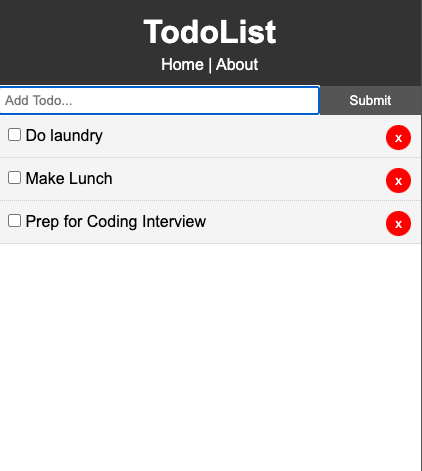

# Angular TodoList
> A simple Todo App built by using Angular.

This project was generated with [Angular CLI](https://github.com/angular/angular-cli) version 11.0.4.

## Development server
Run `ng serve` for a dev server. Navigate to `http://localhost:4200/`. The app will automatically reload if you change any of the source files.

## Code scaffolding
Run `ng generate component component-name` to generate a new component. You can also use `ng generate directive|pipe|service|class|guard|interface|enum|module`.

## Build
Run `ng build` to build the project. The build artifacts will be stored in the `dist/` directory. Use the `--prod` flag for a production build.

## Running unit tests
Run `ng test` to execute the unit tests via [Karma](https://karma-runner.github.io).

## Running end-to-end tests
Run `ng e2e` to execute the end-to-end tests via [Protractor](http://www.protractortest.org/).

## Further help
To get more help on the Angular CLI use `ng help` or go check out the [Angular CLI Overview and Command Reference](https://angular.io/cli) page.

## Meta
- Andrew Hong – hello@andrewhong.tech
- Distributed under the MIT license. See ``LICENSE`` for more information.
- [https://github.com/itsandrewhong/angular-todolist](https://github.com/itsandrewhong/)

## Contributing
1. Fork it (<https://github.com/itsandrewhong/angular-todolist/fork>)
2. Create your feature branch (`git checkout -b feature/fooBar`)
3. Commit your changes (`git commit -am 'Add some fooBar'`)
4. Push to the branch (`git push origin feature/fooBar`)
5. Create a new Pull Request